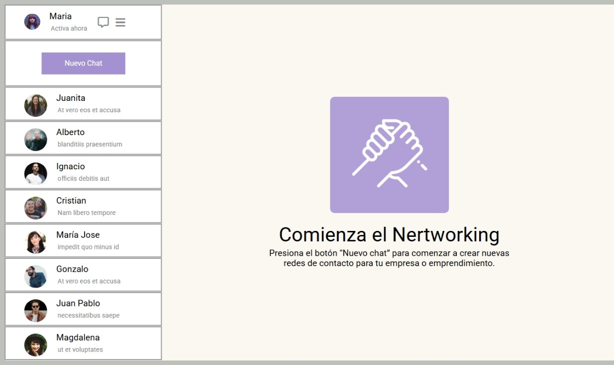

# flexbox-css-avanzado

 Requerimientos cumplidos
✅ Se utilizaron contenedores con display: flex para estructurar la página en dos columnas:

Sección lateral (Contactos)

Sección principal (Chat)

✅ En la sección principal se centraron el logo y los textos con Flexbox.

✅ Se listaron los contactos de forma vertical usando Flex, mostrando al menos el nombre de cada uno.

✅ Cada contacto contiene:

📷 Imagen del contacto

📝 Último mensaje enviado
Ambos elementos fueron posicionados con Flex.

✅ Se incluyó un botón "Nuevo Chat", centrado en su contenedor con Flexbox.

✅ Se agregó el estatus del usuario al inicio de la sección de contactos, incluyendo:

Imagen de perfil

Iconos de configuración y más opciones

💡 Herramientas y Tecnologías

HTML5

CSS3

Flexbox

Git & GitHub

🚀 Cómo ver el proyecto

git clone https://github.com/Andreadavj/css-flexbox-avanzado.git

🧠 Aprendizajes y Reflexión
Este desafío me permitió reforzar el uso de Flexbox como herramienta principal para construir interfaces modernas, mejorando la comprensión de cómo distribuir, alinear y posicionar elementos en distintos contextos visuales. También practiqué la estructura semántica en HTML y la organización del código CSS.

✨ Autora
Doris Valverde Jara
Frontend Developer | GitHub | LinkedIn

